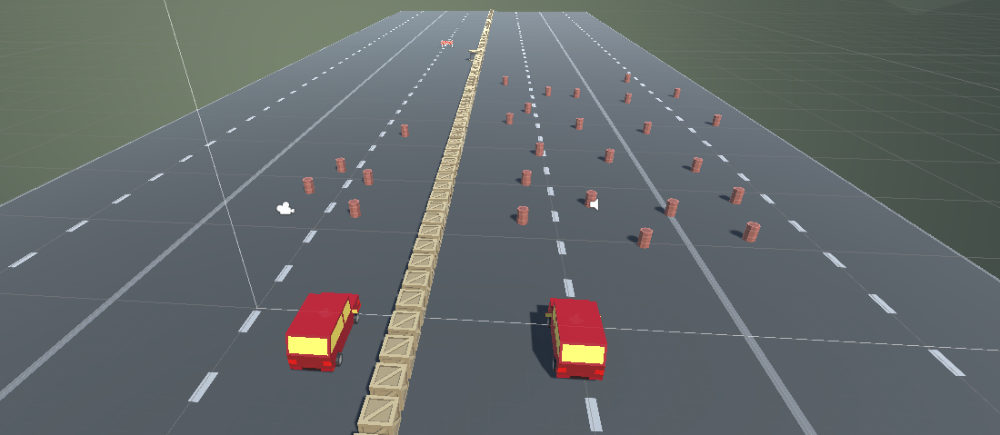
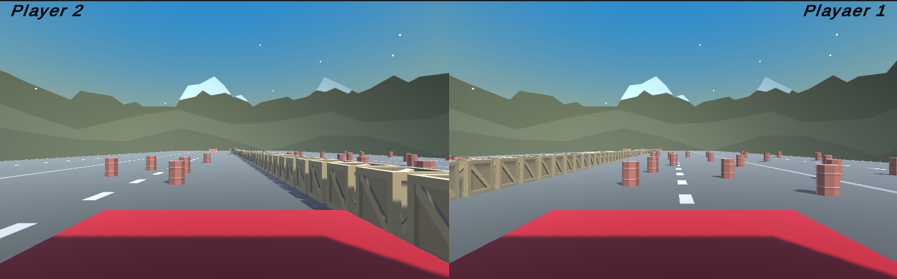

# Simple 3D Racing Game

## Overview

This simple 3D racing game is designed as an introductory project for learning Unity and game development basics. It features a two-player mode where players can race against each other on a track filled with various obstacles.

## Game Features

-   **Two-Player Mode**: Compete head-to-head with another player in split-screen mode.
-   **Control Options**:
    -   Player 1 uses the `W`, `A`, `S`, `D` keys to move forward, left, back, and right.
    -   Player 2 uses the Arrow keys (`↑`, `↓`, `←`, `→`) to navigate their vehicle.
-   **Obstacles**: The track includes various obstacles that challenge players and add complexity to the race.
-   **Simple Physics**: Utilizes Unity's physics engine to handle collisions and vehicle dynamics.

## Screenshots

"# 3D-Racing-Game" 
